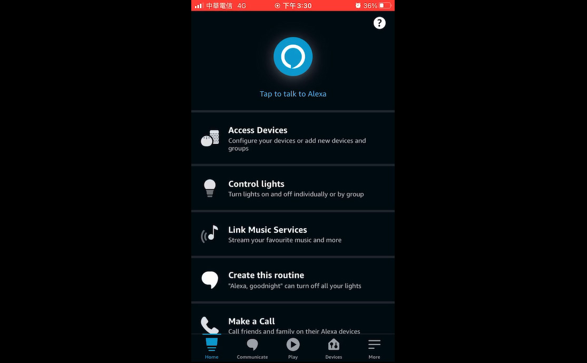

# ACK-HMCU

## Notice
Before using this porting, you should attend Amazon recommendations. For more details, please refer below hyperlink.
https://developer.amazon.com/en-US/docs/alexa/ack/ack-device-sdk.html#ack-sdk-4

## Merge
### For ACK_HMCU_SDK3 user:
Please download ACK_Device_SDK_3.2 package from ACK developer resource. 
Then, make sure current branch is 'SDK3' and copy 'numicro_m031' folder in this repository into <Path-to-ACK_Device_SDK3.2>\user\platform\.
### For ACK_HMCU_SDK4 user:
Please download ACK_Device_SDK_4 package from ACK developer resource. 
Then, switch to 'master' branch and copy 'numicro_m031' or others folder in this repository into <Path-to-ACK_Device_SDK4>\user\platform\.

## Datssheet
* [ITM-1261-ACK Datasheet](Datasheet_ITM-1261-ACK_V01.pdf)

## Document
* [ACK-Carrier_manuel_v1.3](ACK-Carrier_manuel_v1.3.pptx)

## Resources
* [Download ACK_Device_SDK](https://developer.amazon.com/alexa/console/ack/resources)

### Demonstration Video Clips
